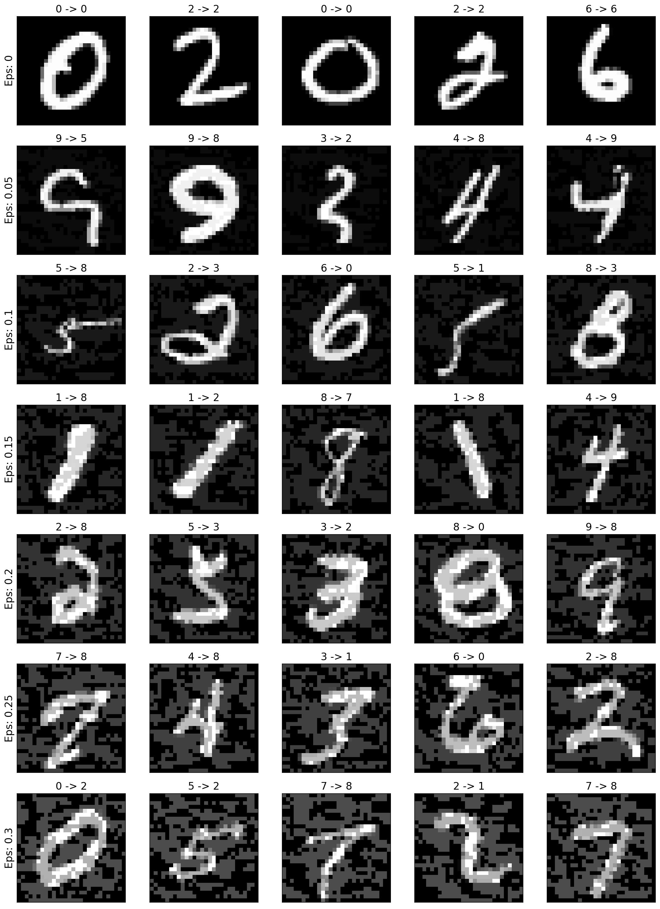

# CV-Playground<!-- omit in toc -->
- [Adversarial Attack](#adversarial-attack)

## Adversarial Attack

FGSM (Fast Gradient Sign Attack) attack is a white-box attack with the goal of misclassification.

In this project, I first use the FGSM attack to generate adversarial examples for the MNIST dataset.

Here, epsilon is the pixel-wise perturbation amount. As epsilon increases, the adversarial example is more likely to be misclassified.

However, as epsilon increases, the perturbations become more easily to be perceived. There is a tradeoff between accuracy degredation and perceptibility. Here are some examples of successful attacks at each epsilon value:

After that, I tried the same strategy on the ImageNet dataset. The results show that the model on ImageNet is more vulnerable to attacks.

The image below illustrates that a small epsilon can achieve a successful attack, which is often imperceptible to humans.

